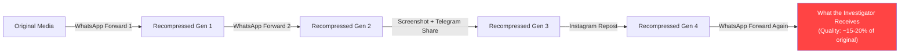
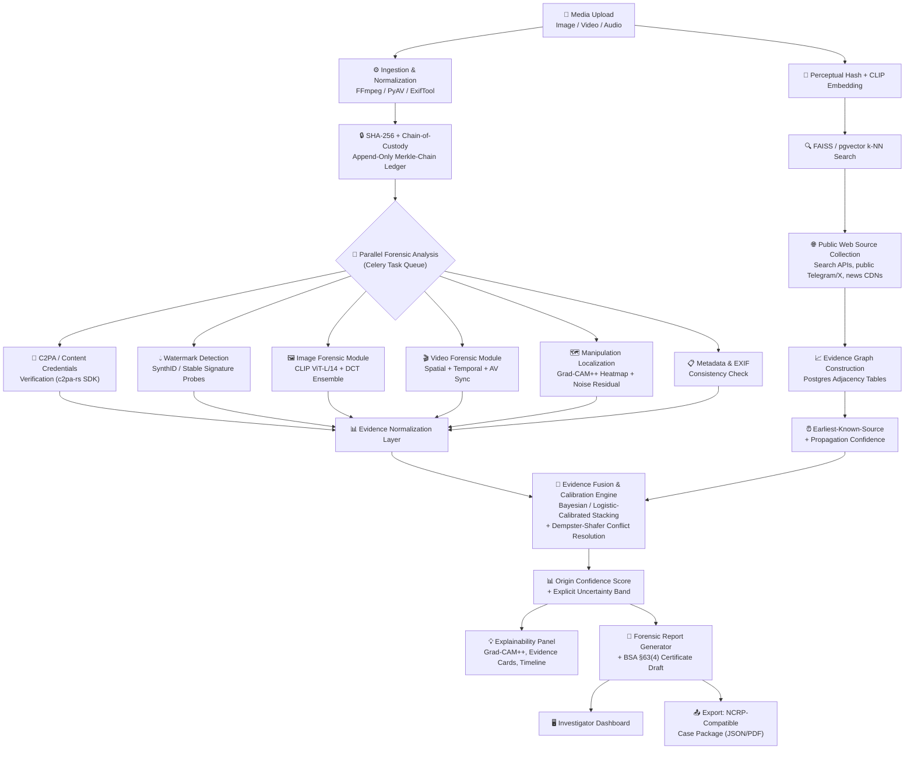
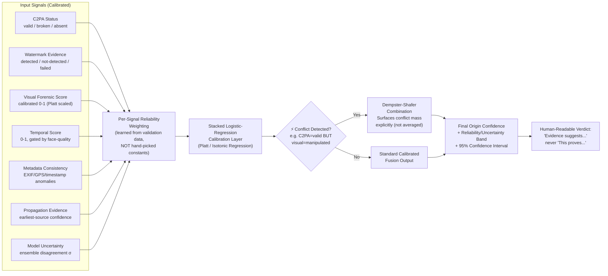
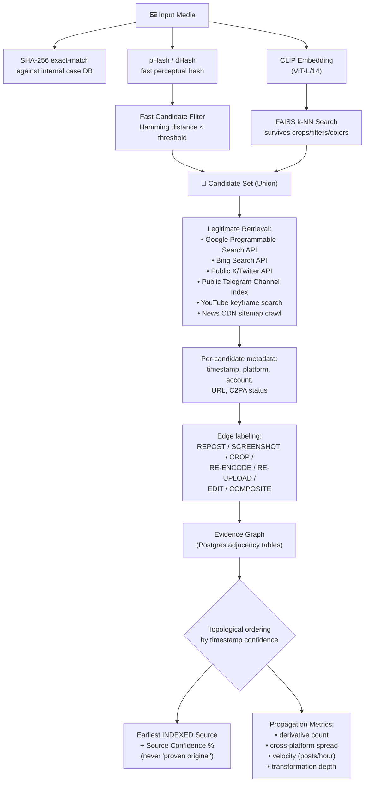
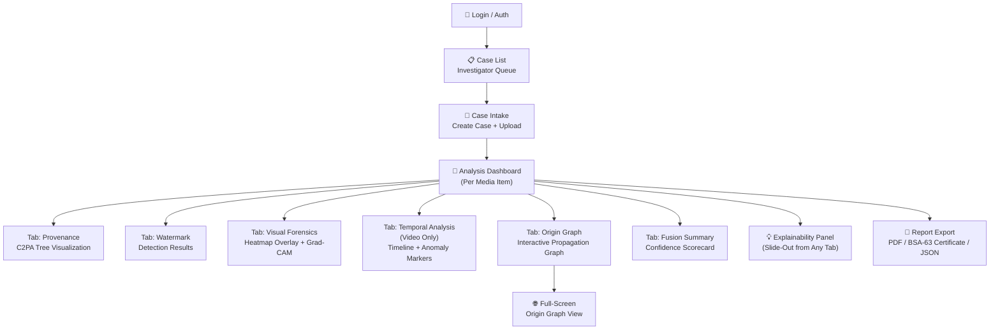
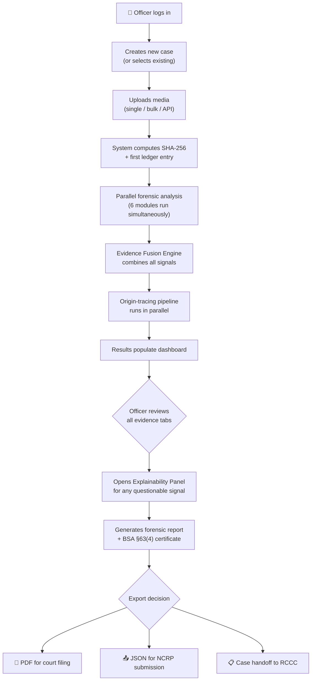
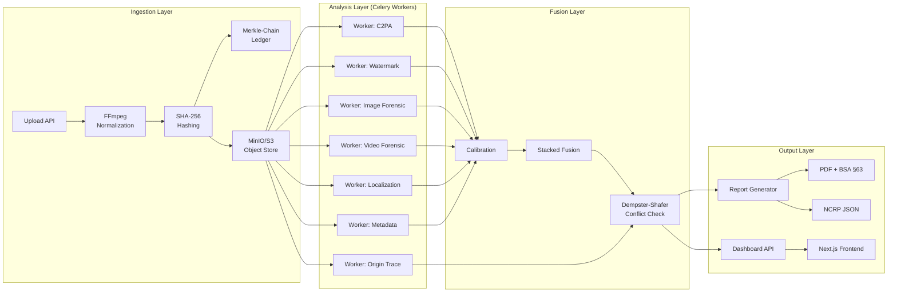

# 🔍 PratiBimb Praman — AI Media Forensic Provenance & Origin Intelligence Platform

### Chandigarh Police National Hackathon 2026 — Problem Statement: AI Media Detection & Source Tracing
### 24-Hour Offline Hackathon: September 8, 2026 | Grand Finale: September 9, 2026

> **"PratiBimb" (प्रतिबिम्ब)** = reflection/mirror | **"Praman" (प्रमाण)** = proof/evidence
> *A platform that verifies whether a digital reflection of reality is genuine — and proves it in court.*

---

## 1. Problem Statement

> Build an AI-powered digital forensic platform to detect AI-generated or manipulated images and videos, verify their authenticity, and trace their origin and dissemination across social media. The solution should help combat misinformation, impersonation, cyber fraud, and digital evidence tampering.

---

## 2. Problem Statement — Deep Breakdown

This single paragraph actually contains **eight distinct technical challenges**. Most teams will treat it as one binary classification problem. We decompose it properly:

### Detection Layer
- **Fully AI-generated media** — images/videos entirely synthesized by generative models (Midjourney, DALL-E, Stable Diffusion, Sora, Kling)
- **AI-manipulated media** — real content with AI-inpainted, face-swapped, or voice-cloned modifications (partial fakes)
- **Conventionally edited media** — Photoshop-style splicing, copy-move, retouching (non-AI manipulation)
- **Authentic/untouched media** — genuinely unmodified content from real capture devices

### Verification Layer
- **Cryptographic provenance verification** — C2PA/Content Credentials validation, watermark integrity checks
- **Chain-of-custody establishment** — hash-verified, tamper-evident audit trail from ingestion to report

### Tracing Layer
- **Origin tracing** — find the earliest indexed instance of a piece of media across the open, crawlable web
- **Dissemination mapping** — reconstruct the propagation graph (which accounts, which platforms, what velocity, what transformations were applied at each hop)

### Application Layer
- **Combat misinformation** — output must be interpretable, uncertainty-aware, and usable by journalists/officers/courts
- **Combat impersonation** — specific detection of face-swap/voice-clone targeting identifiable individuals (not just "is this synthetic")
- **Combat cyber fraud** — fast bulk triage for digital arrest scams, UPI fraud screenshots, romance scam recordings
- **Combat evidence tampering** — the platform's own output must survive scrutiny as legally admissible evidence

---

## 3. Indian Scenario — Why This Matters Here, Specifically

> [!IMPORTANT]
> A hackathon judged by Chandigarh Police will reward a team that demonstrates deep understanding of the **Indian** threat surface, not a generic global one.

### 3.1 Scale & Statistics (2025–2026, Research-Verified)

| Metric | Data Point | Source |
|---|---|---|
| **Total cyber fraud losses** | ₹52,976 crore over 6 years (as of June 2026) | NHRC Report, 2026 |
| **Digital arrest scam losses** | ₹22,495 crore in 2025 alone (~8-9% of total) | ORF Analysis, 2026 |
| **NCRP complaint surge** | 2.6 lakh (2021) → 24 lakh (2025) — ~9x growth | India Today / NCRP |
| **Voice clone vulnerability** | 47% of Indian adults report deepfake/voice-clone victimization (nearly 2x global average); 83% suffered monetary loss | McAfee Global Survey, 2025 |
| **Election deepfakes** | ~280% rise around 2024 Lok Sabha; 50M+ AI-voice-clone calls documented in a two-month window | Multiple verified reports |
| **I4C intervention** | ₹11,000+ crore saved via CFCFRMS across 32.8 lakh+ complaints | MHA/PIB, 2026 |

### 3.2 Why Generic (Western-Benchmark) Detectors Fail in India



- **Compression punishment is extreme** — WhatsApp aggressively recompresses every send; content forwarded 3-10+ times through groups loses the very artifacts detectors rely on. No public benchmark models this "Indian recompression chain"
- **C2PA coverage is near-zero** — Content Credentials are adopted by high-end devices/Adobe/Google, but the realistic Indian case is a WhatsApp-forwarded screenshot-of-a-screenshot with all metadata stripped by the 3rd or 4th re-share
- **Vernacular content is underrepresented** — Hindi/Punjabi/regional text overlays, Telegram channel branding, meme-style compositing — types absent from FaceForensics++/DFDC/Celeb-DF (Western-face, English, studio-lit)
- **Primary channel is uncrawlable** — WhatsApp (E2E encrypted) and private Telegram groups cannot be scraped; origin tracing must be honest about this boundary
- **Indian face/skin-tone/accent gap** — Major datasets (DFDC, Celeb-DF) are overwhelmingly Western faces; detector performance on Indian demographics is an open, untested question

### 3.3 The Legal & Institutional Landscape (Differentiation Goldmine)

> [!TIP]
> Most hackathon teams will not research this. Doing so is a **direct, defensible way to stand out** to a police audience.

#### Criminal Statutes (for deepfake cases)
| Law | Relevant Sections | Application |
|---|---|---|
| **Bharatiya Nyaya Sanhita (BNS), 2023** | §308 (extortion), §336 (forgery — explicitly covers AI-morphed content), §351 (criminal intimidation), §356 (defamation) | Primary criminal charges for deepfake offenses |
| **IT Act, 2000 (as amended)** | §66C (identity theft), §66D (personation via computer), §66E (privacy violation), §67/67A (obscene/explicit content) | Cyber-specific charges |
| **IT Rules, Nov 2025/Feb 2026** | Takedown within **3 hours** of government/court order (24h for sexual deepfakes, 36h for other synthetic misinformation) | Our forensic report is the artifact that triggers this clock |

#### The Make-or-Break Legal Requirement
**Bharatiya Sakshya Adhiniyam (BSA), 2023 — Section 63** (replaced Evidence Act §65B on 1 July 2024):

```
┌─────────────────────────────────────────────────────┐
│  BSA Section 63(4) Certificate — DUAL CERTIFICATION │
├─────────────────────────────────────────────────────┤
│  PART A: Person in lawful control of device/data    │
│    - Device details (Make, Model, Serial, IMEI/MAC) │
│    - Operating conditions during material period    │
│    - Attestation that output is faithful/accurate   │
│                                                     │
│  PART B: Independent technical expert               │
│    - Technical verification of integrity            │
│    - Hash values (SHA-256) of evidence              │
│    - Tool/software identification                   │
│    - Process description                            │
│                                                     │
│  NEW REQUIREMENT: Mandatory hash value disclosure   │
└─────────────────────────────────────────────────────┘
```

> **This is a concrete, buildable feature, not a slide bullet.** No commercial deepfake detector (Reality Defender, Sensity, Hive) auto-generates a BSA-63(4) certificate. This is our single strongest, narrowest, most defensible differentiator.

#### Institutional Ecosystem (Design to Plug In, Not Compete)
- **I4C** (Indian Cyber Crime Coordination Centre) → NCRP portal, 1930 helpline, CFCFRMS, CyTrain, Pratibimb (geospatial), Regional RCCCs
- **Chandigarh-specific**: High digital literacy UT, Punjab/Haryana/Delhi corridor = realistic cross-jurisdictional demo scenario

---

## 4. What Makes This Project Unique — Evidence Fusion, Not Another Classifier

> [!IMPORTANT]
> **Core Thesis**: Every individual forensic signal is beatable. The novelty is the **fusion layer** that knows how much to trust each signal under Indian real-world degradation, stays honest about uncertainty, and outputs something a magistrate can accept.

### Signal Strength/Weakness Compensation Matrix

| Signal | Strength | Documented Weakness | Our Compensation |
|---|---|---|---|
| **C2PA/Content Credentials** | Cryptographically strong when present; 2000+ member coalition | Near-zero adoption on Indian devices; stripped by re-encoding/screenshotting | **Positive-only signal** — absence contributes near-zero weight to fake score |
| **Invisible Watermarks** (SynthID, Stable Signature) | Detectable even after some cropping/resizing | Mature open-source removal ecosystem exists ("Stable Signature is Unstable", arXiv 2405.07145) | **Presence = strong AI evidence; absence = near-neutral** (could be real OR stripped) |
| **CLIP/DINOv2 Learned Classifiers** (LNCLIP-DF style) | Best generalization to unseen generators (0.03% params fine-tuned) | Degrades under recompression chains; no localization/explanation | Wrapped with **Indian Recompression Augmentation** + separate localization head |
| **Frequency-Domain / DCT Analysis** | Cheap, fast, catches GAN upsampling artifacts | Diffusion outputs leave different signatures; JPEG destroys high-frequency signal | **Fast pre-filter only** — vote down-weighted when JPEG quality-factor is low |
| **Perceptual Hashing** (pHash/dHash) | Fast, no ML needed, resilient to mild recompression | Breaks under flips, crops, color changes | **Two-stage retrieval**: pHash fast filter → CLIP embedding + FAISS k-NN second pass |
| **Video Temporal Analysis** | Catches face-reenactment/lip-sync deepfakes | Needs visible, front-facing, well-lit face; fails on degraded WhatsApp video | Temporal confidence **gated by face-quality check**; reports `LOW_CONFIDENCE` rather than guessing |
| **Manipulation Localization** (heatmaps) | Gives "where," not just "whether" — critical for court explainability | Classic splicing models don't transfer to AI-generated regions | Fine-tuned on **both** splicing (CASIA/IMD2020) AND diffusion-manipulation (GIM-style) sets |
| **Origin/Propagation Graph Tracing** | The genuinely underserved gap in commercial market | Only searches indexable open web; WhatsApp/private groups invisible | Explicit "earliest **indexed** source" language; never "proven original" |

### How We Differ From Everyone Else

| Dimension | Typical Hackathon Project | Commercial APIs (Reality Defender/Sensity/Hive) | **PratiBimb Praman** |
|---|---|---|---|
| **Output** | Single fake-probability score | Calibrated score, sometimes with generator ID | **Multi-signal fused score with explicit uncertainty + conflict surfacing** |
| **Provenance (C2PA)** | Usually ignored | Not a focus | **First-class module with absence-≠-fake rule enforced in code** |
| **Watermark robustness** | Assumed reliable | Not publicly detailed | **Tested against real open-source removal tools, honestly reported** |
| **Origin tracing** | Absent | Absent (detect-only tools) | **Core module — the market's stated gap** |
| **India-specific robustness** | Clean-benchmark accuracy | Not published | **Multi-generation WhatsApp/Telegram/Instagram recompression testing** |
| **Legal admissibility** | Not considered | Generic "court-ready" claims | **Auto-generated BSA §63(4) certificate, India-law-specific** |
| **Institutional fit** | Standalone demo | Standalone SaaS | **Designed to plug into I4C/NCRP/CyTrain, not compete** |
| **Honesty about limits** | Rarely stated | Rarely stated | **Explicit uncertainty bands, stated crawling boundaries** |
| **Explainability** | None or basic | Score-based | **Grad-CAM++ heatmaps, evidence cards, SHAP attributions, landmark mapping** |

### How We Differ From IndiaAI Mission Projects

| Their Projects | Ours |
|---|---|
| **Saakshya** (IIT Jodhpur/Madras): RAG-based detection + governance framework | We add **origin-tracing propagation graphs** + **legal-admissibility automation** (BSA-63) neither of which Saakshya addresses |
| **AI Vishleshak** (IIT Mandi): Audio-visual forgery + handwriting detection | We add **multi-signal evidence fusion with Dempster-Shafer conflict resolution** + **India-specific recompression robustness** |
| **IIT Kharagpur** voice detection: Synthetic speech focus only | We integrate voice as **one branch** of a multi-modal fusion pipeline, not a standalone tool |

---

## 5. Technical Approach — Brain & Skeleton

### The Skeleton (Pipeline Engineering)
The pipeline: **Ingestion → Parallel Analysis Modules → Evidence Graph → Report**. Solid engineering (FastAPI, queues, storage) but NOT where novelty lives.

### The Brain (Evidence Fusion & Calibration Engine)
The **statistically defensible** way to combine C2PA status, watermark evidence, visual/temporal forensic scores, and propagation evidence into one **calibrated, uncertainty-aware** Origin Confidence output.



---

## 6. Evidence Fusion Engine — The "Brain" (Detailed)



### Why Dempster-Shafer, Not Just Weighted Average?

Traditional approaches average conflicting signals, producing a "misleadingly confident middle score." DST:
- **Explicitly models epistemic uncertainty** (what we don't know)
- **Surfaces conflict** as a named quantity in the report rather than hiding it
- **Prevents overconfidence** — when detectors disagree, the output uncertainty band widens (correct behavior) rather than collapsing to a middling score (incorrect behavior)
- Research-backed: Inter-Branch Disagreement Calibration (IBDC) from recent forensic literature links predictive uncertainty directly to evidence stream conflicts

### Sample Output Format
```
╔══════════════════════════════════════════════════════╗
║  FORENSIC ANALYSIS REPORT — Case #CHD-2026-04921    ║
╠══════════════════════════════════════════════════════╣
║  Authenticity Assessment:  HIGHLY SUSPICIOUS         ║
║  AI Generation Probability: 91%  (95% CI: 84–95%)   ║
║  Manipulation Probability:  84%                      ║
║  Provenance Integrity:      32%                      ║
║  Watermark Evidence:        Detected (SynthID-like)  ║
║  Earliest Indexed Source:   @user_xyz, X.com         ║
║    Source Confidence:       76%                       ║
║  Propagation Confidence:    88% (17 derivatives)     ║
║                                                      ║
║  Evidence Summary:                                   ║
║    ✓ C2PA chain broken at hop 3                      ║
║    ✓ Diffusion-like frequency artifacts               ║
║      (weight reduced: JPEG-Q=41)                     ║
║    ✓ Temporal inconsistency in frames 142-189        ║
║      (face-quality: adequate)                        ║
║    ✓ Same media found in 17 derivative posts         ║
║    ⚠ Conflict: no independent confirmation of        ║
║      earliest-source timestamp                       ║
║                                                      ║
║  BSA §63(4) Certificate:   Auto-generated (attached) ║
╚══════════════════════════════════════════════════════╝
```

---

## 7. Origin-Tracing / Propagation-Graph Pipeline



> **Critical Design Decision**: We use only legitimate, ToS-compliant retrieval (official search APIs, public channels). We do NOT attempt to access encrypted/private WhatsApp groups or paywalled content. This limitation is **stated proactively** as a design strength (we respect platform ToS and privacy law), not hidden as a weakness.

---

## 8. Backend — Module-by-Module Technical Architecture

### 8.1 Ingestion & Normalization Service
```python
# Pseudocode — shows the chain-of-custody pattern
@app.post("/api/v1/ingest")
async def ingest(file: UploadFile, case_id: str):
    raw_bytes = await file.read()
    sha256 = hashlib.sha256(raw_bytes).hexdigest()
    
    # Append-only Merkle chain (each row hashes the previous row's hash)
    prev_hash = get_last_ledger_hash(case_id)
    ledger_entry = {
        "case_id": case_id,
        "action": "INGEST",
        "sha256": sha256,
        "timestamp": utc_now(),
        "prev_hash": prev_hash,
        "entry_hash": sha256(f"{prev_hash}{sha256}{utc_now()}")
    }
    insert_ledger(ledger_entry)
    
    # Normalize via FFmpeg/PyAV
    normalized = normalize_media(raw_bytes)
    
    # Dispatch parallel analysis tasks
    celery_group([
        c2pa_check.s(sha256),
        watermark_probe.s(sha256),
        image_forensic.s(sha256),
        metadata_check.s(sha256),
        localization.s(sha256),
        origin_trace.s(sha256),
    ]).apply_async()
```

### 8.2 C2PA Verification Module
- Uses **official `c2pa-rs` SDK** (Rust) via Python bindings or `c2patool` CLI
- Four-state output (never binary): `VALID_PROVENANCE` | `BROKEN_CHAIN` (strong manipulation signal) | `NO_CREDENTIALS` (neutral) | `UNSUPPORTED_FORMAT`
- **Hard rule enforced in code**: `NO_CREDENTIALS` NEVER pushes fusion score toward "fake"

### 8.3 Watermark Detection Module
- Ensemble of watermark probes (SynthID-style correlation, frequency-domain checks)
- Three-state output: `DETECTED` | `NOT_DETECTED` | `VERIFICATION_FAILED`
- **Built-in honesty test**: run detector against images processed by public removal tools to show judges the detection-rate drop

### 8.4 Image Forensic Module (Core Detector)
```
┌─────────────────────────────────────────────────┐
│  BACKBONE: Frozen CLIP ViT-L/14 or DINOv2      │
│  ↓                                               │
│  LayerNorm-Only Fine-Tuning (0.03% params)      │
│  (per LNCLIP-DF: best generalization to          │
│   unseen generators across 13 benchmarks)        │
│  ↓                                               │
│  ENSEMBLE:                                       │
│  ├─ Branch A: CLIP/DINOv2 classifier head       │
│  ├─ Branch B: DCT-residual CNN                  │
│  │   (auto-downweighted for low JPEG-Q)          │
│  └─ Branch C: DFF-Adapter (multi-head LoRA,     │
│       dual supervision: auth + manipulation type)│
│  ↓                                               │
│  Calibrated Score (Platt scaling)                │
│  ↓                                               │
│  TRAINING DATA:                                  │
│  • GenImage (1M+ images, 7 generators)           │
│  • + Indian Recompression Robustness Set         │
│    (WhatsApp/Telegram/Instagram forward cycles)  │
└─────────────────────────────────────────────────┘
```

### 8.5 Video Forensic Module
- **Frame sampling**: uniform + scene-change-triggered keyframes
- **Spatial branch**: reuses image forensic module per sampled frame
- **Temporal branch**: MediaPipe FaceMesh → landmark tracking → blink rate, head-pose jitter, optical flow consistency (RAFT/Farneback)
- **Audio-visual branch**: SyncNet-style lip-sync correlation — flags voice-clone-over-real-video
- **Face-quality gate**: temporal/AV scores gated by resolution/quality threshold; below threshold → `LOW_CONFIDENCE_INSUFFICIENT_QUALITY`

### 8.6 Manipulation Localization
- Noise-residual + patch-level classifier (MantraNet/BusterNet-style)
- Fine-tuned on CASIA v2 + IMD2020 (classic splicing) **plus** GIM (diffusion-manipulation)
- Output: **Grad-CAM++ heatmap overlay** in UI and embedded in PDF report
- Integration with MediaPipe Face Mesh for landmark-mapped suspicious region highlighting

### 8.7 Evidence Fusion & Calibration Engine
1. **Stage 1 — Per-signal calibration**: Platt scaling / isotonic regression so "0.8" means the same across all modules
2. **Stage 2 — Stacked fusion**: Logistic-regression stacking learns reliability weights from data (not hand-tuned)
3. **Stage 3 — Conflict handling**: Dempster-Shafer combination when signals disagree, surfacing conflict as named uncertainty

### 8.8 BSA §63(4) Certificate Auto-Generator
```
Auto-populated fields:
├── Part A: Device/System Information
│   ├── Platform: "PratiBimb Praman v1.0"
│   ├── Deployment: "On-premise / Docker"
│   ├── Operating period attestation
│   └── Data regularity attestation
│
├── Part B: Technical Expert Certification
│   ├── Evidence hash (SHA-256): [auto-computed]
│   ├── Tool identification: [auto-filled]
│   ├── Process description: [auto-generated from analysis log]
│   └── Integrity verification: [hash chain validation]
│
└── Blank fields (for human signatures):
    ├── Officer signature (Part A)
    └── Technical expert signature (Part B)
```

---

## 9. Languages & Libraries

### Languages
| Language | Where Used | Why |
|---|---|---|
| **Python 3.11+** | ML pipeline, FastAPI backend, orchestration | Dominant ML ecosystem; every library below has first-class Python support |
| **Rust** (via SDK, not hand-written) | C2PA verification | `c2pa-rs` is the official reference implementation |
| **TypeScript/JavaScript** | Frontend (Next.js/React) | Interactive evidence-graph visualization, dashboard |
| **SQL** | Postgres queries, evidence graph, ledger | Relational integrity for case data + chain-of-custody |

### Backend / ML Libraries

| Library | Purpose | Why This One |
|---|---|---|
| **FastAPI** | API layer | Async, auto-generates OpenAPI docs — useful for I4C integration story |
| **Celery + Redis** | Task queue | Parallel forensic analysis pipeline; each module runs as independent Celery task |
| **PyTorch + timm** | Model backbones | `timm` provides ready ViT/ConvNeXt/DINOv2 backbones |
| **open_clip / HuggingFace transformers** | CLIP feature extraction | LNCLIP-DF-style generalization approach |
| **OpenCV** | Frequency-domain analysis, general CV | Standard FFT/DCT tooling |
| **FFmpeg + PyAV** | Video/audio decode, normalization | Industry-standard; PyAV gives Python bindings |
| **MediaPipe** | Face landmark tracking | Fast, CPU-friendly blink/head-pose features |
| **librosa** | Audio feature extraction | Lip-sync/voice analysis |
| **c2pa-python / c2patool** | C2PA manifest verification | Official SDK — correctness over convenience |
| **ExifTool (pyexiftool)** | Metadata extraction | Most complete extractor; covers formats OpenCV/PIL miss |
| **imagehash** | pHash/dHash computation | Simple, well-tested, matches two-stage retrieval design |
| **FAISS** or **pgvector** | Nearest-neighbor search | FAISS for scale; pgvector for hackathon simplicity (everything in one Postgres) |
| **scikit-learn** | Calibration (Platt/isotonic), stacking | Calibrated probabilities, not raw softmax |
| **PostgreSQL** | Case data, ledger, evidence graph | Relational integrity + JSONB + pgvector in one DB |
| **ReportLab / WeasyPrint** | PDF report generation | Auto-generates BSA §63(4) certificate + forensic report |
| **Docker / Docker Compose** | Deployment | One-command demo spin-up for judges |

### Frontend Libraries

| Library | Purpose | Why |
|---|---|---|
| **Next.js 14 + React 18** | Dashboard UI | Fast iteration, SSR, good ecosystem |
| **Tailwind CSS** | Styling | Speed under hackathon time pressure |
| **React Flow** or **vis-network** | Evidence/propagation graph visualization | Purpose-built interactive node-link graphs |
| **Chart.js / Recharts** | Confidence score visualizations | Clean defaults, reliability diagrams |
| **react-image-crop** | Heatmap overlay display | Show Grad-CAM++ manipulation localization |

---

## 10. Research Required (What a Judge Will Actually Probe)

> [!WARNING]
> These are not optional stretch goals — they are the research tasks that separate a credible submission from a generic demo.

| # | Research Task | Why It Matters | Effort |
|---|---|---|---|
| 1 | **Build Indian Recompression Robustness Set** — Forward real + AI images through actual WhatsApp/Telegram/Instagram send cycles (3-5 generations), measure detector AUC decay per hop | **Genuinely novel** — no public benchmark models India-specific multi-hop recompression | 4-6 hours pre-hackathon |
| 2 | **Quantify real-world C2PA coverage** on a sample of Indian social-media-sourced images | Justifies (with data) why fusion model treats C2PA absence as near-neutral | 2-3 hours |
| 3 | **Study BSA §63(4) schedule** in detail with a law student/advocate | Ensures auto-generated certificate is legally complete, not just plausible-looking | 2-3 hours |
| 4 | **Test face-swap/voice-clone detection on Indian-face/accent data** | Measure performance gap honestly (even if worse — that's a legitimate finding) | 3-4 hours |
| 5 | **Confirm legal/ToS boundaries** of origin-tracing crawler | Document what you deliberately do NOT attempt (private groups, authenticated content) | 1-2 hours |
| 6 | **Benchmark against NTIRE 2026 protocol** — 108,750 real + 185,750 AI images, 42 generators, 36 post-processing types | Validates robustness methodology against peer-reviewed benchmark | 3-4 hours |

---

## 11. Wireframes — Key Screens

### Screen Map


### Case Intake Screen
```
┌──────────────────────────────────────────────────┐
│  🔍 PratiBimb Praman — New Case                 │
├──────────────────────────────────────────────────┤
│                                                  │
│  Case ID:    [Auto-generated: CHD-2026-_____]    │
│  NCRP #:     [Optional: Link to cybercrime.gov.in│
│               complaint number]                  │
│  Officer:    [Auto from login]                   │
│  Category:   [Deepfake ▼ | Impersonation ▼ |    │
│               Misinformation ▼ | Fraud ▼]        │
│                                                  │
│  ┌────────────────────────────────────────┐      │
│  │                                        │      │
│  │     📁 Drop files here or click        │      │
│  │        to upload                       │      │
│  │                                        │      │
│  │     Supports: JPG, PNG, MP4, WAV,      │      │
│  │     WEBM, MKV (max 500 MB)             │      │
│  │                                        │      │
│  │     [Bulk Upload API endpoint shown]    │      │
│  │                                        │      │
│  └────────────────────────────────────────┘      │
│                                                  │
│  SHA-256: [Computed on upload, displayed live]    │
│                                                  │
│  [ Start Analysis ]  [ Save Draft ]              │
└──────────────────────────────────────────────────┘
```

### Analysis Dashboard (Core Screen)
```
┌──────────────────────────────────────────────────────┐
│ Case: CHD-2026-04921  │ Status: Analysis Complete    │
├──────────────────────────────────────────────────────┤
│ [Provenance] [Watermark] [Visual▾] [Temporal] [Origin│Graph] [Fusion Summary]
├──────────────────────────────────────────────────────┤
│                                                      │
│  ┌─────────────────────┐  ┌──────────────────────┐   │
│  │                     │  │ Fusion Scorecard      │   │
│  │  [Image with        │  │                      │   │
│  │   Grad-CAM++        │  │ AI-Generated:  91%   │   │
│  │   Heatmap Overlay]  │  │ (CI: 84-95%)         │   │
│  │                     │  │                      │   │
│  │  🔍 Zoom | 🔄 Toggle│  │ Manipulated:   84%   │   │
│  │  Opacity: ████░░░   │  │ Provenance:    32%   │   │
│  │                     │  │ Watermark:  Detected  │   │
│  └─────────────────────┘  │                      │   │
│                           │ Verdict:             │   │
│  Evidence Cards:          │ ⚠ HIGHLY SUSPICIOUS  │   │
│  ┌────────────────────┐   │                      │   │
│  │ ✓ C2PA chain       │   │ [📄 Generate Report] │   │
│  │   broken at hop 3  │   │ [📤 Export NCRP JSON]│   │
│  │ ✓ Diffusion        │   └──────────────────────┘   │
│  │   artifacts found  │                              │
│  │ ✓ 17 derivative    │                              │
│  │   posts located    │                              │
│  │ ⚠ Timestamp        │                              │
│  │   unconfirmed      │                              │
│  └────────────────────┘                              │
│                                                      │
│  [ 💡 Explain This Score ]  ← Opens Explainability   │
│                                Panel                 │
└──────────────────────────────────────────────────────┘
```

---

## 12. System Flowcharts

### End-to-End User Flow


### Data Flow Architecture


---

## 13. How This Helps Police & Law Enforcement — Concretely

| # | Benefit | Mechanism |
|---|---|---|
| 1 | **Speeds up takedown clock** | Under IT Rules Nov 2025/Feb 2026, platforms must act within 3-36 hours. Our report is produced in **minutes**, not days |
| 2 | **Solves the admissibility gap** | BSA §63(4) certificate auto-generated — removes the manual, error-prone, delay-inducing paperwork step |
| 3 | **Bulk fraud triage** | Digital arrest scams generate large volumes; bulk-upload + case-queue lets officers triage many pieces quickly |
| 4 | **Cross-jurisdiction handoff** | Structured JSON/NCRP-compatible export → complete evidence package for I4C RCCC coordination |
| 5 | **Training-aligned** | Report format and terminology aligned with CyTrain → lower adoption barrier |
| 6 | **Protects the institution** | Since police impersonation is itself a major fraud vector (digital arrest scams), rapidly verifying whether a "police video/audio" is deepfake protects public trust |
| 7 | **Evidence integrity** | Hash-chained, append-only ledger makes the analysis history itself tamper-evident |

---

## 14. Hackathon Scope vs. Production Vision

### 24-Hour Build Priority (September 8)

| Priority | Module | Time Est. | Status |
|---|---|---|---|
| **P0** | Ingestion + SHA-256 + Chain-of-Custody Ledger | 2-3 hours | Foundation — build first |
| **P0** | Image Forensic Module (CLIP-based detector) | 4-5 hours | The visible "does it work" core |
| **P0** | Evidence Fusion Engine (≥3 signals: C2PA + watermark + visual) | 3-4 hours | **THE differentiator — do NOT cut for UI polish** |
| **P1** | BSA §63(4) Certificate Auto-Generator | 2-3 hours | Single strongest law-enforcement feature |
| **P1** | Basic Origin-Tracing Demo (pHash + 1 search API) | 2-3 hours | Enough to show concept live |
| **P2** | Dashboard UI (Next.js) | 3-4 hours | Polish last, after pipeline works |
| **P2** | Manipulation Localization (Grad-CAM++ heatmap) | 2-3 hours | High-impact visual for judges |

### Explicitly Cut/Simplified (Say So Honestly If Asked)
- Full video temporal analysis → "Tier 2, implemented but not demoed live"
- Neo4j graph DB → Postgres adjacency tables (fine for demo scale)
- Large-scale FAISS indexing → Small curated demo corpus
- Full cross-platform propagation → Single search-engine API demo

---

## 15. Referenced Research Papers & Resources

### Core Surveys
| Paper | Citation | Relevance |
|---|---|---|
| AI-Generated Image Detection: Empirical Study | arXiv 2511.02791 (Nov 2025) | Names three failure modes of typical projects |
| Methods and Trends in Detecting AI-Generated Images | arXiv 2502.15176 (Feb-Oct 2025) | Detector taxonomy for comparison table |
| NTIRE 2026 Challenge on Robust AI-Generated Image Detection | arXiv 2604.11487 (2026) | Template for robustness methodology |
| Community Forensics: Thousands of Generators | arXiv 2411.04125 (2024) | Cross-generator generalization |
| Universal Fake Image Detectors (Ojha et al.) | CVPR 2023 | Foundational frozen-CLIP approach |
| DF40: Next-Gen Deepfake Detection | NeurIPS 2024 | 40-method benchmark |
| LNCLIP-DF | arXiv 2508.06248 | LayerNorm-only fine-tuning = best generalization |

### Detection & Forensics
| Resource | Citation | Use |
|---|---|---|
| DFD-FCG (CVPR'25) | github.com/aiiu-lab/DFD-FCG | Video deepfake detection side-network |
| C2P-CLIP | AAAI 2025 | Category-prompt CLIP for cross-generator generalization |
| DFF-Adapter | arXiv (2025) | Multi-head LoRA for DINOv2 deepfake detection |
| DeepFake Forensics AI | arXiv (2026) | Multi-modal + blockchain evidence anchoring |
| MM-DeepGuard | ResearchGate (2026) | Edge-cloud hybrid architecture |
| M2F2-Det | CVPR (2026) | CLIP + LLM explainable forensic reports |

### GitHub Repositories
| Repo | Use |
|---|---|
| `contentauth/c2pa-rs` | C2PA verification SDK |
| `contentauth/c2pa-attacks` | C2PA attack simulator (for robustness testing) |
| `SCLBD/DeepfakeBench` | Standardized benchmark harness (9 datasets) |
| `GenImage-Dataset/GenImage` | Primary training/eval set (1M+ images, 7 generators) |
| `greatzh/Image-Forgery-Datasets-List` | Master dataset index (~15 localization datasets) |
| `aiiu-lab/DFD-FCG` | Video deepfake detection (CLIP-based) |
| `mattpodolak/duplicate-img-detection` | FastAPI + imagehash + FAISS scaffold for origin tracing |
| `siddharthksah/DeepSafe` | Open-source ensemble detection platform |
| `jvishwa06/DeepTracersV0` | Social media integration + reverse image search |
| `CodeRafay/Forensic-Image-Analysis-Toolkit` | 14+ forensic analysis methods |

---

## 16. Honest Limitations (State Proactively — Builds Credibility)

> [!CAUTION]
> Stating limitations proactively is a **strength**, not a weakness, with a technical/legal judging panel.

1. **Cannot trace into encrypted/private channels** — WhatsApp groups, private Telegram. Origin tracing is bounded to the legally-accessible indexable web
2. **No detector achieves 0% false-positive/negative rates** — the platform's job is to make uncertainty visible, not eliminate it
3. **C2PA-based provenance** depends on ecosystem adoption — will be absent (not decisive) for majority of Indian cases in near future
4. **Watermark detection** is in active arms race with removal tools — one weighted signal, never standalone verdict
5. **"Earliest known source"** is a retrieval result, not definitive proof of true origin
6. **Indian-face/accent detection performance** may differ from Western-benchmark results — an honest finding either way
7. **Model generalization** to entirely novel generators post-training remains an open challenge — we mitigate via foundation-model features and broad training, but cannot guarantee zero-day detector performance

---

## 17. The One-Sentence Pitch

> *"Every individual signal in this space is beatable — what nobody in the commercial market has shipped is a fusion layer that knows exactly how much to trust each signal under Indian real-world degradation, stays honest about what it can't prove, and outputs something a magistrate can actually accept under BSA Section 63."*

---

## Open Questions

> [!IMPORTANT]
> **Before proceeding to code, please confirm:**

1. **Team composition** — How many team members? Their technical strengths (ML, backend, frontend, legal)?
2. **Pre-hackathon prep time** — How many days before Sep 8 to prepare the Indian Recompression Dataset and pre-train models?
3. **Hardware available** — Will you have GPU access during the hackathon? What specs (VRAM)?
4. **Demo strategy** — Do judges evaluate a live demo, a recorded video, or a presentation + partial demo?
5. **Should I begin building the codebase** — Start with the skeleton (FastAPI + Docker + Postgres) or focus on the ML pipeline first?
