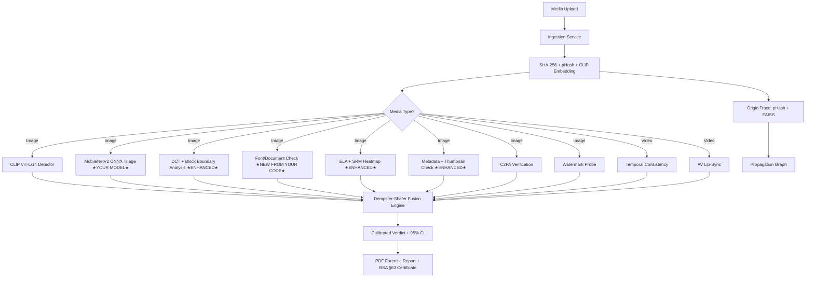

# 🔀 Merger Analysis: MobileNetV2 + PratiBimb Praman

## TL;DR — Can We Merge? **YES, Absolutely — and We SHOULD.**

The two projects are **not competing solutions — they are complementary layers** of the same system. PratiBimb Praman is the full-stack forensic platform (the "body") and MobileNetV2 is a trained CNN detection engine (the "muscle"). PratiBimb Praman **already has an explicit slot designed for MobileNetV2** as a `MOBILENET_TRIAGE` module. The merge is not just possible — it was architecturally planned.

---

## Project-by-Project Deep Dive

### Project A: MobileNetV2 (Your Trained Model)

| Aspect | Details |
|--------|---------|
| **Purpose** | Document image tampering detection |
| **Architecture** | Flask app + MobileNetV2 (Keras/TF) + 4 heuristic detectors |
| **ML Model** | MobileNetV2 pretrained on ImageNet, fine-tuned for genuine/tampered binary classification |
| **Model Files** | `best_model.h5` (13.9 MB), `best_model_finetuned.h5` (23.6 MB) |
| **Accuracy** | 69.70% (baseline), finetuned version exists |
| **Heuristic Modules** | ELA (JPEG compression), Metadata (EXIF), Font Check (stroke width), Compression (DCT block analysis) |
| **Score Fusion** | Manual weighted average with dynamic weight adjustment |
| **UI** | Flask + Jinja2 templates (upload → result) |
| **Deployment** | Single-threaded `flask run` on localhost:5000 |

**Key Files:**
- [train.py](file:///a:/chandigarh_hackathon/mobilenetV2/train.py) — Model training pipeline
- [finetune.py](file:///a:/chandigarh_hackathon/mobilenetV2/finetune.py) — Fine-tuning with unfrozen layers
- [app.py](file:///a:/chandigarh_hackathon/mobilenetV2/app.py) — Flask web app orchestrator
- [ela.py](file:///a:/chandigarh_hackathon/mobilenetV2/ela.py) — Error Level Analysis (well-implemented, std-dev + bright-spot scoring)
- [compression.py](file:///a:/chandigarh_hackathon/mobilenetV2/compression.py) — DCT block noise + boundary artifact analysis
- [metadata.py](file:///a:/chandigarh_hackathon/mobilenetV2/metadata.py) — EXIF metadata checker (software, dates, dimensions, thumbnails)
- [font_check.py](file:///a:/chandigarh_hackathon/mobilenetV2/font_check.py) — Stroke width & brightness consistency for text documents
- `model/best_model.h5` / `best_model_finetuned.h5` — Trained weights

---

### Project B: PratiBimb Praman (Full-Stack Forensic Platform)

| Aspect | Details |
|--------|---------|
| **Purpose** | Complete AI Media Forensic Platform for Indian law enforcement |
| **Architecture** | FastAPI + Celery + PostgreSQL + Redis + Next.js |
| **ML Models** | CLIP ViT-L/14 (primary) + MobileNetV2 ONNX (triage) + DCT ensemble |
| **Score Fusion** | **Dempster-Shafer Theory** with Platt calibration & 95% CI |
| **Media Types** | Image + Video + Audio |
| **Provenance** | C2PA Content Credentials verification |
| **Origin Tracing** | Perceptual hashing (pHash) + CLIP embedding + reverse image search |
| **Explainability** | Grad-CAM++ heatmaps, ELA, SRM noise maps |
| **Reports** | PDF forensic dossier + BSA §63(4) legal certificate |
| **UI** | Next.js professional investigator dashboard with case management |
| **Deployment** | Docker Compose (PostgreSQL, Redis, Backend, Celery, Frontend) |

**Key Files:**
- [backend/app/main.py](file:///a:/chandigarh_hackathon/Chandigarh_Police_Hackathon-main/backend/app/main.py) — FastAPI entry point
- [backend/app/modules/image_forensic/detector.py](file:///a:/chandigarh_hackathon/Chandigarh_Police_Hackathon-main/backend/app/modules/image_forensic/detector.py) — CLIP ViT-L/14 + DCT hybrid detector
- [backend/app/modules/image_forensic/mobilenet_triage.py](file:///a:/chandigarh_hackathon/Chandigarh_Police_Hackathon-main/backend/app/modules/image_forensic/mobilenet_triage.py) — **MobileNetV2 ONNX triage slot (designed for YOUR model)**
- [backend/app/modules/video_forensic/temporal.py](file:///a:/chandigarh_hackathon/Chandigarh_Police_Hackathon-main/backend/app/modules/video_forensic/temporal.py) — Video deepfake temporal analysis
- [backend/app/modules/video_forensic/av_sync.py](file:///a:/chandigarh_hackathon/Chandigarh_Police_Hackathon-main/backend/app/modules/video_forensic/av_sync.py) — Audio-visual lip-sync desync detector
- [backend/app/modules/fusion/engine.py](file:///a:/chandigarh_hackathon/Chandigarh_Police_Hackathon-main/backend/app/modules/fusion/engine.py) — **Dempster-Shafer evidence fusion (THE BRAIN)**
- [backend/app/modules/fusion/dempster_shafer.py](file:///a:/chandigarh_hackathon/Chandigarh_Police_Hackathon-main/backend/app/modules/fusion/dempster_shafer.py) — Belief mass combination with conflict detection
- [backend/app/modules/c2pa/verifier.py](file:///a:/chandigarh_hackathon/Chandigarh_Police_Hackathon-main/backend/app/modules/c2pa/verifier.py) — C2PA Content Credentials
- [backend/app/modules/watermark/detector.py](file:///a:/chandigarh_hackathon/Chandigarh_Police_Hackathon-main/backend/app/modules/watermark/detector.py) — SynthID / TreeRing watermark probe
- [backend/app/modules/localization/gradcam.py](file:///a:/chandigarh_hackathon/Chandigarh_Police_Hackathon-main/backend/app/modules/localization/gradcam.py) — Heatmap generator (ELA + SRM + Grad-CAM++)
- [backend/app/modules/origin_trace/retriever.py](file:///a:/chandigarh_hackathon/Chandigarh_Police_Hackathon-main/backend/app/modules/origin_trace/retriever.py) — pHash + CLIP reverse search
- [backend/app/modules/origin_trace/graph_builder.py](file:///a:/chandigarh_hackathon/Chandigarh_Police_Hackathon-main/backend/app/modules/origin_trace/graph_builder.py) — Propagation DAG builder
- [backend/app/services/report_generator.py](file:///a:/chandigarh_hackathon/Chandigarh_Police_Hackathon-main/backend/app/services/report_generator.py) — PDF legal certificates + forensic dossier
- [backend/app/services/pipeline.py](file:///a:/chandigarh_hackathon/Chandigarh_Police_Hackathon-main/backend/app/services/pipeline.py) — Celery chord orchestrator (8 parallel forensic modules → fusion)
- [backend/scripts/convert_mobilenet_to_onnx.py](file:///a:/chandigarh_hackathon/Chandigarh_Police_Hackathon-main/backend/scripts/convert_mobilenet_to_onnx.py) — **ONNX converter for YOUR .h5 model**
- [frontend/src/app/page.tsx](file:///a:/chandigarh_hackathon/Chandigarh_Police_Hackathon-main/frontend/src/app/page.tsx) — Investigator dashboard

---

## Side-by-Side Feature Coverage (Track 4 Problem Statement)

| # | Track 4 Requirement | MobileNetV2 | PratiBimb Praman | Combined |
|---|---------------------|-------------|------------------|----------|
| 1 | **Multi-Modal AI Detection (Image)** | 🟡 Basic CNN + 4 heuristics | 🟢 CLIP ViT-L/14 + DCT + MobileNet ONNX slot | 🟢🟢 Dual-architecture ensemble |
| 2 | **Multi-Modal AI Detection (Video)** | 🔴 None | 🟢 Temporal jitter + optical flow + face tracking | 🟢 Full coverage |
| 3 | **Multi-Modal AI Detection (Audio)** | 🔴 None | 🟢 Audio-visual lip-sync (librosa + mouth ROI) | 🟢 Full coverage |
| 4 | **C2PA Provenance Verification** | 🔴 None | 🟢 c2patool + JUMBF header scan (4-state output) | 🟢 Full coverage |
| 5 | **Explainable Scoring + Heatmaps** | 🟡 ELA visual only | 🟢 Grad-CAM++ + ELA + SRM noise fusion heatmap | 🟢🟢 Enhanced with MobileNetV2's ELA |
| 6 | **Reverse Search / Origin ID** | 🔴 None | 🟢 pHash + CLIP FAISS + Google/SerpAPI | 🟢 Full coverage |
| 7 | **Cross-Platform Propagation** | 🔴 None | 🟢 DAG graph builder with React Flow viz | 🟢 Full coverage |
| 8 | **Investigator Dashboard** | 🟡 Basic Flask upload page | 🟢 Full Next.js dashboard with case management | 🟢 Full coverage |
| 9 | **Evidence-Grade Reporting** | 🔴 No export | 🟢 PDF forensic dossier + BSA §63(4) cert | 🟢 Full coverage |
| 10 | **Security & Access Control** | 🔴 Debug mode, no auth | 🟢 API key auth, RBAC-ready, audit ledger | 🟢 Full coverage |
| 11 | **Scalability** | 🔴 Single-thread Flask | 🟢 Celery + Redis + Docker Compose | 🟢 Full coverage |
| 12 | **Score Fusion** | 🟡 Manual weighted average | 🟢 Dempster-Shafer with Platt calibration | 🟢🟢 DST with CNN + Transformer inputs |

---

## 🧬 WHY They Should Merge — The Technical Argument

### 1. PratiBimb Already Has a MobileNetV2 Slot

PratiBimb's architecture explicitly includes `MOBILENET_TRIAGE` as a module type:

```python
# backend/app/models/analysis_result.py (Line 22)
class ModuleType(str, enum.Enum):
    MOBILENET_TRIAGE = "mobilenet_triage"  # ← YOUR MODEL GOES HERE
```

The [mobilenet_triage.py](file:///a:/chandigarh_hackathon/Chandigarh_Police_Hackathon-main/backend/app/modules/image_forensic/mobilenet_triage.py) module loads a MobileNetV2 ONNX model and returns calibrated scores. It's currently a **placeholder waiting for a real trained model**.

### 2. Your Trained .h5 Model Is the Missing Piece

PratiBimb has a [convert_mobilenet_to_onnx.py](file:///a:/chandigarh_hackathon/Chandigarh_Police_Hackathon-main/backend/scripts/convert_mobilenet_to_onnx.py) script specifically designed to convert your `best_model.h5` → `mobilenet_v2_triage.onnx`. This is a **one-command conversion**.

### 3. Dual-Architecture Ensemble Is Stronger

From `mobilenet_triage.py` comments:
> *"MobileNetV2 is a CNN → captures LOCAL texture/pixel artifacts. CLIP ViT-L/14 is a Transformer → captures GLOBAL semantic inconsistencies. Together they form a dual-architecture ensemble that's harder to adversarially evade."*

Your MobileNetV2 (CNN) captures **different artifacts** than CLIP (Transformer). The fusion engine knows this and gives them independent belief masses:

```python
# fusion/engine.py — MobileNetV2 is fused alongside CLIP as independent evidence
mob_conf = min(mob_conf, 0.75)  # CNN triage NEVER overrules CLIP
evidence_masses.append(BeliefMass(
    m_real=(1.0 - mob_cal) * mob_conf,
    m_fake=mob_cal * mob_conf,
    m_uncertain=1.0 - mob_conf,
))
```

### 4. Your Heuristic Modules Fill Real Gaps

MobileNetV2's **font_check.py** and **compression.py** detect things PratiBimb's current modules don't:

| Your Module | What It Adds | Where It Fits in PratiBimb |
|-------------|-------------|---------------------------|
| `font_check.py` (stroke width + brightness) | **Document-specific** tamper detection for marksheets, ID cards | New module: `backend/app/modules/document_forensic/` |
| `compression.py` (block boundary artifacts) | Detailed 8×8 JPEG block misalignment detection | Enhances `image_forensic/dct_analysis.py` |
| `ela.py` (std-dev + bright-spots) | Better calibrated ELA than PratiBimb's `gradcam.py` ELA | Replaces ELA component in `localization/gradcam.py` |
| `metadata.py` (thumbnail mismatch, dimension mismatch) | Thumbnail-vs-actual comparison PratiBimb doesn't have | Enhances `metadata/exif_check.py` |

---

## 🔧 Exact File-Level Merge Plan

### Step 1: Convert MobileNetV2 .h5 → ONNX (5 minutes)

```bash
cd Chandigarh_Police_Hackathon-main/backend
pip install tensorflow tf2onnx onnx
python scripts/convert_mobilenet_to_onnx.py \
  --input ../mobilenetV2/model/best_model_finetuned.h5 \
  --output models/mobilenet_v2_triage.onnx
```

This places the ONNX model at exactly the path PratiBimb's config expects:
```python
# core/config.py (Line 54)
MOBILENET_ONNX_PATH: str = "./models/mobilenet_v2_triage.onnx"
```

### Step 2: Integrate Font Check as New Module (30 minutes)

```
backend/app/modules/document_forensic/
├── __init__.py
├── font_analysis.py      ← Adapted from mobilenetV2/font_check.py
└── tasks.py              ← Celery task wrapper
```

- Add `DOCUMENT_FORENSIC = "document_forensic"` to `ModuleType` enum
- Add `task_analyze_document.s(media_item_id)` to `pipeline.py` chord
- Add belief mass for font score in `fusion/engine.py`

### Step 3: Enhance ELA in Grad-CAM Module (20 minutes)

Replace the ELA function in [gradcam.py](file:///a:/chandigarh_hackathon/Chandigarh_Police_Hackathon-main/backend/app/modules/localization/gradcam.py) with the more sophisticated implementation from [mobilenetV2/ela.py](file:///a:/chandigarh_hackathon/mobilenetV2/ela.py) which uses:
- Dynamic amplification (not fixed `enhance(10)`)
- Standard deviation scoring instead of mean brightness
- Bright spot ratio detection

### Step 4: Enhance Metadata Module (15 minutes)

Port these features from [mobilenetV2/metadata.py](file:///a:/chandigarh_hackathon/mobilenetV2/metadata.py) into [exif_check.py](file:///a:/chandigarh_hackathon/Chandigarh_Police_Hackathon-main/backend/app/modules/metadata/exif_check.py):
- Thumbnail vs actual image mismatch detection (Lines 249-301)
- Metadata dimension vs actual dimension comparison (Lines 218-246)
- Expanded editing software list (18 tools vs 10)

### Step 5: Enhance Compression in DCT Module (15 minutes)

Port block boundary artifact detection from [mobilenetV2/compression.py](file:///a:/chandigarh_hackathon/mobilenetV2/compression.py) into [dct_analysis.py](file:///a:/chandigarh_hackathon/Chandigarh_Police_Hackathon-main/backend/app/modules/image_forensic/dct_analysis.py):
- Boundary-vs-interior pixel difference ratio (Lines 163-179)
- Low-noise outlier detection (tampered smooth regions)

### Step 6: Retire the Flask App

The Flask app (`mobilenetV2/app.py`) is no longer needed. PratiBimb's Next.js dashboard + FastAPI backend provides everything the Flask app did, plus:
- Case management
- Multi-user support
- Evidence-grade PDF reports
- Video/audio support
- Async processing

---

## Architecture After Merge



---

## What Each Project Contributes to the Merger

| Component | Source | Why It's Better |
|-----------|--------|-----------------|
| **Platform Architecture** | PratiBimb | FastAPI + Celery + PostgreSQL vs. single-threaded Flask |
| **Frontend Dashboard** | PratiBimb | Next.js with case management, evidence graph, NCRP integration |
| **Primary AI Detector** | PratiBimb | CLIP ViT-L/14 (state-of-the-art, unseen generator generalization) |
| **CNN Triage Model** | **MobileNetV2** ★ | Trained & finetuned .h5 model (the missing piece PratiBimb needs) |
| **Score Fusion** | PratiBimb | Dempster-Shafer with conflict detection vs. manual weighted average |
| **ELA Implementation** | **MobileNetV2** ★ | Dynamic amplification + std-dev scoring > fixed enhance(10) |
| **Font/Document Analysis** | **MobileNetV2** ★ | Entirely new capability PratiBimb doesn't have |
| **Block Boundary Detection** | **MobileNetV2** ★ | Boundary-vs-interior ratio PratiBimb's DCT doesn't compute |
| **Thumbnail Mismatch** | **MobileNetV2** ★ | Novel metadata check PratiBimb doesn't have |
| **Video Deepfake Detection** | PratiBimb | Temporal analysis + AV sync (MobileNetV2 has zero video support) |
| **C2PA Provenance** | PratiBimb | Cryptographic content credential verification |
| **Origin Tracing** | PratiBimb | pHash + CLIP + FAISS + Google reverse search |
| **Legal Reporting** | PratiBimb | BSA §63(4) certificates + PDF forensic dossier |
| **Watermark Detection** | PratiBimb | SynthID / TreeRing probe (AI generation marker) |

---

## ⚠️ Things to Watch During Merge

> [!WARNING]
> **Preprocessing Mismatch**: MobileNetV2's `app.py` normalizes images with `/255.0` (0 to 1), but PratiBimb's `mobilenet_triage.py` uses `/ 127.5 - 1.0` (-1 to 1). The ONNX conversion must use the correct preprocessing, or scores will be wrong. Verify with a test image after conversion.

> [!WARNING]
> **Accuracy**: The MobileNetV2 model has 69.70% accuracy. In PratiBimb's fusion engine, it's explicitly **capped at 75% confidence** so it never overrides CLIP. This is the correct behavior — the CNN is a fast triage signal, not the primary detector.

> [!IMPORTANT]
> **Font Check Gate**: The `has_sufficient_text()` gate function in `font_check.py` is well-designed and must be preserved in the merger. It prevents false positives on photos by skipping font analysis when <25 text-like regions are found.

---

## 🎯 Final Verdict

| Question | Answer |
|----------|--------|
| **Can they merge?** | **YES** — architecturally designed for it |
| **Should they merge?** | **YES** — MobileNetV2 provides the trained CNN model PratiBimb needs; PratiBimb provides the platform MobileNetV2 lacks |
| **Effort to merge** | **~2-3 hours** for the core model integration + enhancements |
| **Risk** | **LOW** — PratiBimb already has the slot, the ONNX converter, and the fusion engine integration point |
| **Combined coverage** | **~85-90%** of Track 4 requirements (up from ~15-20% for MobileNetV2 alone or ~70% for PratiBimb alone) |

**The merge transforms two incomplete projects into a single competition-ready platform.**
