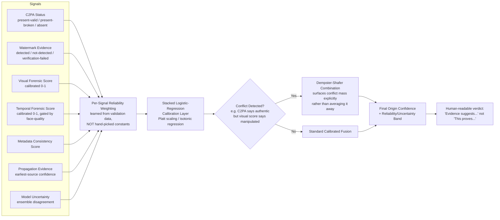

# PratiBimb Praman — AI Media Forensic Provenance & Origin Intelligence Platform
### A submission for Chandigarh Police Hackathon — Problem Statement 4
*("PratiBimb" = reflection/mirror, "Praman" = proof/evidence — a platform that verifies whether a reflection of reality is genuine.)*

> **One-line pitch:** Most teams will build a deepfake classifier that outputs "Fake: 97%." We are building an **evidence-fusion forensic platform** that combines cryptographic provenance, watermark forensics, multi-model visual/temporal analysis, and social-propagation tracing into a single **calibrated, explainable, legally-admissible** origin-confidence report — engineered specifically around how media actually moves and degrades on Indian networks (WhatsApp forwards, Telegram re-shares, repeated re-compression), and around what Indian courts actually require (a Bharatiya Sakshya Adhiniyam Section 63 compliant certificate) to accept it as evidence.

---

## 1. Problem Statement (as given)

Build an AI-powered digital forensic platform to detect AI-generated or manipulated images and videos, verify their authenticity, and trace their origin and dissemination across social media. The solution should help combat misinformation, impersonation, cyber fraud, and digital evidence tampering.

---

## 2. Problem Statement — Explained

Breaking the one paragraph into what a judge will actually score you on:

- **Detect** — determine, per image/video, whether it is (a) fully AI-generated, (b) AI-manipulated/edited on top of real media, (c) conventionally edited (Photoshop-style splicing, not AI), or (d) authentic/untouched. These are four different technical problems, not one binary classifier.
- **Verify authenticity** — go beyond "is it fake" to "can we prove what it is," using cryptographic and provenance evidence (C2PA, watermarks, sensor fingerprints), not just a neural network's opinion.
- **Trace origin** — for a given piece of media, find the earliest instance of it that can be located, and the chain of reposts/edits/derivatives between that instance and the copy in front of the investigator.
- **Trace dissemination** — build a picture of how the media spread (which accounts, which platforms, what velocity), not just where it started.
- **Combat misinformation** — the platform's output must be usable by someone (a journalist, an FIR-writing officer, a court) to make a real decision, which means the output has to be *interpretable and honest about uncertainty*, not just a score.
- **Combat impersonation** — specific technical requirement: face-swap/voice-clone detection tuned to detect a *specific person* being impersonated, not just "is this face synthetic."
- **Combat cyber fraud** — the platform needs a fast, low-friction path (ideally API/bulk-upload) since fraud investigations (digital arrest scams, UPI fraud, romance scams) need triage of large volumes of screenshots and call recordings quickly.
- **Combat digital evidence tampering** — the platform's own output must survive scrutiny as evidence: hash-verifiable, versioned, chain-of-custody logged, and produced in a format Indian courts already accept.

---

## 3. The Indian Scenario — Why This Matters Here, Specifically

A hackathon judged by Chandigarh Police will reward a team that clearly understands the *Indian* threat surface, not a generic global one. Ground the pitch in this:

### 3.1 Scale of the problem
- Deepfake-related cyber-fraud cases in India have grown sharply since 2019, with industry estimates of fraud losses running into tens of thousands of crores annually.
- A 2025 cross-country survey found that **47% of Indian adults** report being a victim of, or knowing someone who was a victim of, an AI voice-cloning or deepfake scam — nearly double the global average of ~25%; of Indian victims, **83% suffered a monetary loss**, with almost half losing over ₹50,000.
- Deepfake attempts around the **2024 Lok Sabha elections rose ~280%**, including AI-cloned voices of deceased political leaders used in campaigning and a documented case of 50+ million AI-voice-clone calls made in a two-month window.
- Widely reported incidents — the Rashmika Mandanna face-swap video, AI-cloned voices of Union ministers spreading false policy claims, synthetic political-endorsement clips involving major film actors during election season — show the pattern: face-swap and voice-clone content going viral on Indian social media within hours, faster than any manual fact-check cycle.
- "**Digital arrest**" scams (fraudsters impersonating police/CBI/customs officials over video call, sometimes using AI-cloned voices or fake uniforms/backdrops) are now a distinct, large-scale fraud category — directly relevant to a *police* hackathon since the platform's own credibility (people impersonating police) is being attacked by the same technology.

### 3.2 Why generic (Western-benchmark) detectors under-perform here
This is the single most important India-specific technical insight, and it should anchor your architecture (see §6):
- **Compression punishment is extreme.** WhatsApp — the dominant media-sharing channel in India — aggressively recompresses every image/video on send, and content is frequently forwarded 3–10+ times through different groups before it reaches an investigator. Each hop re-compresses an already-compressed file. Detectors trained and validated on clean, single-compression academic benchmarks (FaceForensics++, Celeb-DF) degrade sharply under this "recompression chain" pattern, which barely exists in Western benchmark design.
- **C2PA/Content Credentials coverage is near-zero on the devices most fraud actually flows through.** Content Credentials are being adopted by high-end capture devices and by platforms like Adobe/Google/OpenAI at the point of *generation*, but the realistic case an Indian cyber-cell officer faces is a WhatsApp-forwarded screenshot of a screenshot, with every metadata field already stripped by the third or fourth re-share. A system that leans too heavily on "no C2PA found ⇒ suspicious" will flag the overwhelming majority of *legitimate* Indian social content as suspicious — a design trap worth calling out explicitly to judges (see §14, C2PA limitations).
- **Vernacular content.** A large share of forwarded misinformation in India carries embedded Hindi/Punjabi/regional-language text overlays, watermark-style channel branding (common on Telegram forwards), and meme-style compositing — content types under-represented in FaceForensics++/DFDC/Celeb-DF, which are overwhelmingly English-language, Western-face, studio-lit datasets.
- **The channel investigators actually work in is largely uncrawlable.** WhatsApp groups are end-to-end encrypted and cannot be scraped; a large share of Telegram is similarly closed. Your origin-tracing module has to be honest about this limitation (§10) rather than pretending it can "trace across social media" the same way it could trace across the open, indexable web (X/Twitter, public Telegram channels, news sites, YouTube).

### 3.3 The legal and institutional landscape (this is your differentiation goldmine)
Most hackathon teams will not research this — doing so is a direct, defensible way to stand out to a *police* audience specifically.

- **Bharatiya Nyaya Sanhita (BNS), 2023** — the sections that actually get invoked in deepfake cases: **BNS 308** (extortion), **BNS 336** (forgery — explicitly covers AI-generated/morphed synthetic content), **BNS 351** (criminal intimidation), **BNS 356** (defamation).
- **IT Act, 2000 (as amended)** — **Section 66C** (identity theft), **66D** (cheating by personation using a computer resource), **66E** (violation of privacy — capturing/transmitting private images), **67/67A** (obscene / sexually explicit material — relevant to non-consensual intimate imagery deepfakes).
- **IT Rules amendments (Nov 2025 / Feb 2026)** — platforms are now required to take down flagged deepfake content within **3 hours** of a government/court order (24 hours for sexual/explicit deepfakes, 36 hours for other synthetic misinformation, under the 2025 framework). Your platform's forensic report is exactly the artifact an officer needs to generate quickly to trigger that clock.
- **Bharatiya Sakshya Adhiniyam (BSA), 2023, Section 63** — replaced the old Evidence Act Section 65B on **1 July 2024**. This is the make-or-break legal requirement: an electronic record (including a forensic analysis report) is only admissible in an Indian court if accompanied by a **Section 63(4) certificate** — identifying the electronic record, describing how it was produced, specifying the device/tool used, and (per the 2023 refinement) requiring **dual certification**: one from the person in charge of the device/system, and one from a technical expert, including hash values. **This is a concrete, buildable feature, not a slide bullet**: your forensic report generator (§9.6) should auto-populate a BSA-63(4)-compliant certificate template alongside the human-readable report. No commercial deepfake detector reviewed for this project (Reality Defender, Sensity, Hive) advertises this. It is a genuine, narrow, well-scoped differentiator.
- **I4C (Indian Cyber Crime Coordination Centre)**, under MHA — operates the National Cyber Crime Reporting Portal (**cybercrime.gov.in**), the **1930** helpline, the Citizen Financial Cyber Fraud Reporting and Management System (CFCFRMS, which has helped save over ₹11,000 crore across 32.8 lakh+ complaints as of mid-2026), the **Pratibimb** geospatial crime-mapping platform, and **CyTrain**, the training portal used by 1.6 lakh+ police/judicial officers. I4C also runs its own hackathon (**Cyber Guard Hackathon**) and has previously incubated tools like "Crime AI" for fraud-investigation workflows. **Design implication**: your platform should expose an API/export format compatible with NCRP complaint submission (so an officer can push a case's evidence package straight into a cybercrime.gov.in complaint) and should be pitched as a tool that could plug into I4C's existing Regional Cyber Crime Coordination Centre network, not as a standalone app competing with it.
- **Chandigarh-specific framing**: Chandigarh Police's Cyber Cell handles a UT with high digital literacy and high smartphone/social-media penetration relative to national averages, and sits administratively close to the Punjab/Haryana/Delhi corridor — meaning cross-jurisdictional case handoff (a core I4C use case) is a realistic, provable demo scenario for the judges in the room.

---

## 4. What Makes This Project Unique — Combining Strengths, Removing Weaknesses

Every individual forensic signal researched in the companion research file has a well-documented failure mode. The novelty of this project is **not inventing a new detector** — it's **engineering the fusion layer so each signal's weakness is covered by another signal's strength**, and validating the whole stack against *India-realistic* degradation, not just academic benchmarks.

| Signal | Strength | Documented weakness (from research) | How we compensate |
|---|---|---|---|
| **C2PA / Content Credentials** | Cryptographically strong when present; industry-backed (Adobe, Google, Microsoft, OpenAI, 2000+ member coalition) | Near-zero adoption on the capture devices/apps that dominate Indian sharing; stripped by re-encoding/screenshotting; absence is *not* proof of fakery | Treated as a **positive-only** signal in the fusion model — its absence contributes *near-zero* weight to the fake score (only genuinely lowers the "provable-authentic" score), explicitly preventing the "no C2PA ⇒ suspicious" false-positive trap described in §3.2 |
| **Invisible watermarks (SynthID, Stable Signature, etc.)** | Detectable even after some cropping/resizing by design | A mature open-source *removal* ecosystem now exists (regeneration-based and spectral-attack removal tools); "Stable Signature is Unstable" (peer-reviewed) proves removal is practical, not hypothetical | Fusion model treats watermark **presence** as strong positive evidence of AI origin, but watermark **absence** as weak/near-neutral evidence (could mean genuinely real, or could mean successfully stripped) |
| **CLIP/DINOv2-based learned classifiers (LNCLIP-DF style)** | Best current generalization to *unseen generators*, cheap to fine-tune (LayerNorm-only tuning = 0.03% of parameters) | Still degrades under aggressive recompression chains not represented in training; provides no localization, no explanation beyond a score | Wrapped with (a) our own **Indian Recompression Robustness augmentation** (§7) during fine-tuning, and (b) a separate localization head so a raw score is never the only output |
| **Frequency-domain / DCT-residual analysis** | Cheap, fast, good at catching GAN-era upsampling artifacts, doesn't need GPU | Diffusion-model outputs don't leave the same spectral signature as GANs; JPEG recompression destroys the very high-frequency signal being analyzed | Run only as a **fast pre-filter / ensemble vote**, never as the sole decision signal — its vote is down-weighted automatically when the image's JPEG quality-factor estimate is low |
| **Perceptual hashing (pHash/dHash) for origin tracing** | Fast, works without ML, resilient to mild recompression | Breaks under flips, heavy crops, color/filter changes — exactly the transformations social re-shares apply | Two-stage retrieval: pHash as a cheap first-pass filter, CLIP-embedding + FAISS nearest-neighbor as the second-pass signal that survives crops/filters (mirrors the production pattern used in large-scale industry dedup pipelines) |
| **Video temporal analysis (blink rate, lip-sync, head pose)** | Catches face-reenactment/lip-sync deepfakes that pure spatial detectors miss | Needs a visible, front-facing, well-lit face; fails on low-res or heavily-compressed WhatsApp video forwards, which is the most common real-world case in India | Temporal branch confidence is explicitly gated by a face-quality/resolution check; when the face region is too degraded, the platform **says so** rather than returning a falsely-confident score |
| **Manipulation localization (heatmaps)** | Gives investigators a "where," not just a "whether" — critical for court explainability | Localization models trained on splicing datasets (CASIA/IMD2020) don't transfer well to *AI-generated* regions | Trained/fine-tuned on a diffusion-manipulation-specific localization set (GIM-style) in addition to classic splicing sets, so the heatmap works for both "photoshopped" and "AI-inpainted" manipulation |
| **Reverse-image/origin-graph tracing** | The genuinely underserved gap in the commercial market (Reality Defender/Sensity/Hive are all detect-only, no propagation graph) | Can only search the *indexable* open web (X, public Telegram channels, YouTube, news sites) — WhatsApp/private-group content is invisible to any legal crawler | Platform is explicit in its UI and report language about this boundary — "earliest **indexed** source found," never "proven original source" — turning an honest limitation into a credibility signal for a legal audience |

**The one-sentence differentiator to say out loud to judges:** *"Every individual signal in this space is beatable — what nobody in the commercial market has shipped is a fusion layer that knows exactly how much to trust each signal under Indian real-world degradation, stays honest about what it can't prove, and outputs something a magistrate can actually accept."*

---

## 5. System Overview — "Brain" and "Skeleton"

Think of the platform in two layers:

- **The Skeleton** — the pipeline: ingestion → parallel analysis modules → evidence graph → report. This is largely well-understood engineering (FastAPI microservices, queues, storage) and is *not* where your novelty lives. Build it solidly but don't over-invest demo time here.
- **The Brain** — the **Evidence Fusion & Calibration Engine** (§9.7). This is where the actual research contribution lives: a statistically defensible way to combine C2PA status, watermark evidence, visual/temporal forensic scores, and propagation evidence into one calibrated, uncertainty-aware Origin Confidence output — instead of a naive weighted average of unrelated probabilities (a mistake the source research prompt explicitly warns against, and a mistake almost every other team will make).

---

## 6. High-Level Architecture Diagram

```mermaid
flowchart TD
    A[Media Upload<br/>Image / Video / Audio] --> B[Ingestion & Normalization<br/>FFmpeg / PyAV / ExifTool]
    B --> C[SHA-256 + Chain-of-Custody Log Entry]
    C --> D{Parallel Forensic Analysis}

    D --> E1[C2PA / Content Credentials<br/>Verification Module]
    D --> E2[Watermark Detection Module<br/>SynthID / Stable Signature probes]
    D --> E3[Image Forensic Module<br/>CLIP/DINOv2 + Frequency residual ensemble]
    D --> E4[Video Forensic Module<br/>Spatial + Temporal + Audio-Visual sync]
    D --> E5[Manipulation Localization<br/>Heatmap / segmentation head]
    D --> E6[Metadata & EXIF Consistency Check]

    E1 --> F[Evidence Normalization Layer]
    E2 --> F
    E3 --> F
    E4 --> F
    E5 --> F
    E6 --> F

    A --> G[Perceptual Hash + CLIP Embedding]
    G --> H[FAISS / pgvector Nearest-Neighbor Search]
    H --> I[Legitimate Public-Web Source Collection<br/>Search APIs, public Telegram/X, news CDNs]
    I --> J[Evidence Graph Construction<br/>Neo4j / Postgres graph tables]
    J --> K[Earliest-Known-Source + Propagation Confidence]

    F --> L[Evidence Fusion & Calibration Engine<br/>Bayesian / logistic-calibrated stacking]
    K --> L

    L --> M[Origin Confidence Score<br/>+ Explicit Uncertainty]
    M --> N[Explainability Panel<br/>Grad-CAM, evidence cards, timeline]
    M --> O[Forensic Report Generator<br/>+ BSA Section 63(4) Certificate]
    O --> P[Investigator Dashboard]
    O --> Q[Export to NCRP / I4C-compatible case package]
```

---

## 7. The Evidence-Fusion "Brain" — Detailed Flow



---

## 8. Origin-Tracing / Propagation-Graph Pipeline

```mermaid
flowchart TD
    A[Input Media] --> B[SHA-256 exact-match check<br/>against internal case DB]
    A --> C[Perceptual Hash pHash/dHash]
    A --> D[CLIP Embedding]
    C --> E[Fast candidate filter<br/>Hamming distance threshold]
    D --> F[FAISS/pgvector k-NN search<br/>survives crop/filter/color changes]
    E --> G[Candidate Set]
    F --> G
    G --> H[Legitimate retrieval sources:<br/>Search-engine APIs, public news CDNs,<br/>public X/Telegram channel indexes,<br/>YouTube/Reverse-video keyframe search]
    H --> I[Per-candidate metadata extraction<br/>timestamp, platform, account, URL]
    I --> J[Timestamp + Transformation-type<br/>edge labeling between nodes]
    J --> K[Evidence Graph<br/>ORIGINAL? -> REPOST -> SCREENSHOT -> CROP -> RE-UPLOAD -> VIRAL POST]
    K --> L{Topological ordering<br/>by timestamp confidence}
    L --> M["Earliest INDEXED Source<br/>+ Source Confidence %<br/>(never 'proven original')"]
    L --> N[Propagation Confidence<br/>= f(number of derivative nodes,<br/>cross-platform spread, velocity)]
```

---

## 9. Backend — Module-by-Module Technical Approach

### 9.1 Ingestion & Normalization Service
- **What it does**: accepts upload (single file or bulk/API), validates MIME type, normalizes color space/container via FFmpeg/PyAV, computes SHA-256, writes the first chain-of-custody ledger entry (append-only, hash-chained so any retroactive edit to the log is detectable).
- **Why it matters**: this is the one step every downstream legal claim depends on — get the hash and timestamp wrong and the whole report is worthless in court.
- **Tech**: FastAPI + FFmpeg/PyAV + Python `hashlib`; ledger stored as an append-only Postgres table with each row's hash including the previous row's hash (a simple Merkle-chain, not a blockchain — avoid the "we used blockchain" gimmick unless you actually need distributed trust, which a single-department deployment doesn't).

### 9.2 C2PA / Content Credentials Verification
- Use the **official `c2pa-rs` SDK** (Rust) via its Python bindings, or shell out to `c2patool`, rather than re-implementing manifest parsing.
- Output one of four states, never a binary: `VALID_PROVENANCE`, `BROKEN_CHAIN` (tampering evidence — a strong positive signal for manipulation), `NO_CREDENTIALS` (neutral — the overwhelming default case in Indian content), `UNSUPPORTED_FORMAT`.
- **Explicit design rule enforced in code, not just policy**: `NO_CREDENTIALS` must never, by itself, push the fusion score toward "fake." Only `BROKEN_CHAIN` does.

### 9.3 Watermark Detection Module
- Run available open watermark probes (SynthID-style correlation detectors, frequency-domain checks) as an ensemble; each probe outputs `DETECTED`, `NOT_DETECTED`, or `VERIFICATION_FAILED` (e.g., image too small/degraded to test reliably) — three states, not two.
- **Robustness self-test built into the demo**: run the platform's own detector against images already processed by a public watermark-removal tool (from the research file), to honestly show judges the detection-rate drop — this level of self-aware robustness testing is rare and will stand out.

### 9.4 Image Forensic Module (core detector)
- **Backbone**: frozen CLIP ViT-L/14 or DINOv2 features (per Ojha et al. and the LNCLIP-DF result that fine-tuning only the LayerNorm parameters generalizes best to unseen generators) + a lightweight classifier head.
- **Ensemble branch**: an independent frequency-domain/DCT-residual branch (cheap CNN on the FFT residual) that votes separately — its vote is automatically down-weighted for low-JPEG-quality inputs (estimated via quantization-table analysis), so it doesn't drag the ensemble down on WhatsApp-degraded images.
- **Training data**: GenImage (cross-generator protocol) as the base set, **augmented with our own Indian Recompression Robustness Set** (§11) — repeatedly re-compressed/re-shared copies of both real and AI images, generated by literally passing files through WhatsApp/Telegram/Instagram send-and-forward cycles and capturing each generation.

### 9.5 Video Forensic Module
- **Frame sampling**: uniform + scene-change-triggered keyframes (avoids wasting compute on near-duplicate frames).
- **Spatial branch**: reuses the image forensic module per sampled frame.
- **Temporal branch**: face tracking + landmark extraction (MediaPipe FaceMesh), optical flow consistency (RAFT or OpenCV Farneback for a lighter option), blink-rate and head-pose-jitter statistics; CLIP-encoder-based side-network temporal adapter (DFD-FCG-style architecture) for the learned component.
- **Audio-visual branch**: lip-sync consistency score (SyncNet-style correlation between mouth movement and audio phoneme timing) — flags voice-clone-over-real-video and face-swap-with-mismatched-audio cases specifically relevant to digital-arrest-scam call recordings.
- **Face-quality gate**: temporal/AV scores are only reported with full confidence when face resolution and frame quality clear a minimum threshold; below that, the module reports `LOW_CONFIDENCE_INSUFFICIENT_QUALITY` rather than guessing.

### 9.6 Manipulation Localization
- Patch-level classifier + noise-residual map (MantraNet/BusterNet-style architecture as a starting point) fine-tuned on CASIA v2 + IMD2020 for classic splicing, **plus** a diffusion-manipulation localization set (GIM-style) so the heatmap also works for AI-inpainted regions, not just copy-move/splice.
- Output rendered as a heatmap overlay in the investigator UI and embedded directly into the PDF forensic report — this single feature is what turns "the AI said fake" into "here is specifically what's wrong with this pixel region," which is what makes a report usable in an interview/interrogation context.

### 9.7 Evidence Fusion & Calibration Engine ("the Brain")
- **Not** a hand-tuned weighted sum (explicitly rejected per the research brief's own critique).
- **Stage 1 — per-signal calibration**: each module's raw score is independently calibrated (Platt scaling or isotonic regression) against a held-out validation set so "0.8" means the same thing coming out of every module.
- **Stage 2 — stacked fusion**: a logistic-regression (or gradient-boosted trees for a slightly richer model, if time permits) stacking layer learns the *reliability weight* of each signal from data, rather than the team guessing weights.
- **Stage 3 — conflict handling**: when signals actively disagree (e.g., valid C2PA but a high visual-manipulation score — which can legitimately happen, e.g., an AI-generated image that was later signed by a compliant app), apply Dempster-Shafer combination so the **conflict itself is surfaced as a named uncertainty** in the report rather than silently averaged into a misleadingly confident middle score.
- **Output structure** (matches the format specified in the source research brief):
  ```
  Authenticity Assessment: HIGHLY SUSPICIOUS
  AI Generation Probability: 91%  (95% CI: 84–95%)
  Manipulation Probability: 84%
  Provenance Integrity: 32%
  Watermark Evidence: Detected
  Earliest Indexed Source: [Source X]  (Source Confidence: 76%)
  Propagation Confidence: 88%
  Evidence:
    ✓ C2PA chain broken
    ✓ Diffusion-like frequency artifacts (weight reduced: JPEG-Q=41)
    ✓ Temporal inconsistency detected (face-quality: adequate)
    ✓ Same media found in 17 derivative posts
    ⚠ Conflict: no independent confirmation of earliest-source timestamp
  ```

### 9.8 Origin-Tracing Module
- **Two-stage retrieval** (§4 table): pHash/dHash fast filter → CLIP-embedding FAISS/pgvector k-NN for the survivable-to-editing second pass.
- **Legitimate sourcing only**: official search-engine APIs (Google Programmable Search / Bing Search API), public news-site RSS/sitemap crawling, public X/Telegram-channel APIs where ToS-compliant — explicitly **not** unauthorized scraping of private groups or paywalled/authenticated content. State this limitation on a slide; it is a strength ("we respect platform ToS and privacy law"), not a weakness, to a police audience.
- **Evidence graph**: nodes = each located instance (hash, pHash, timestamp, source URL, platform, account, C2PA status, forensic score); edges = inferred transformation type (crop/screenshot/re-encode/re-upload) with a similarity score. Stored in Postgres with an adjacency/edge table (Neo4j only if time permits — don't let graph-DB setup eat hackathon time that should go to the fusion engine).
- **Earliest-source algorithm**: topological ordering by timestamp, with confidence explicitly discounted when timestamps are self-reported/platform-supplied rather than independently verifiable (e.g., a platform's "posted 3 years ago" label vs. a cryptographically signed capture time) — and the output is always phrased as **"earliest known/indexed source,"** never "proven original."

### 9.9 Forensic Report & Chain-of-Custody Generator
- Human-readable PDF/HTML report (investigator-facing) + a machine-readable JSON (for I4C/NCRP system integration) + an **auto-populated BSA Section 63(4) certificate draft** — pre-filling the electronic-record identification, device/tool description, and hash values the law requires, leaving only the human signature fields blank. This is the single most concrete "how does this help law enforcement" feature in the whole project — build a working version of this for the demo, not just a mockup.
- Every analysis run appends to the same hash-chained ledger as ingestion (§9.1), so the full history of "who ran what analysis, with what tool version, when" is itself tamper-evident.

---

## 10. Wireframe — Screens

| Screen | Purpose | Key elements |
|---|---|---|
| **Case Intake** | Officer creates a case, uploads media (single or bulk) | Case ID, complainant linkage (optional NCRP complaint number field), file drop zone, auto-hash display |
| **Analysis Dashboard** (per media item) | The core screen | Tabs: *Provenance* (C2PA tree) · *Watermark* · *Visual Forensics* (heatmap overlay) · *Temporal* (video only, timeline scrubber with anomaly markers) · *Origin Graph* (interactive node graph) · *Fusion Summary* (the scorecard from §9.7) |
| **Origin Graph View** | Full-screen propagation graph | Force-directed graph (React Flow / vis-network), node click → source detail card, timeline slider to replay spread over time |
| **Explainability Panel** | Slide-out panel on any tab | Grad-CAM heatmap, "why this score" evidence-card list, uncertainty band visualization |
| **Report Export** | Generates the deliverable | Toggle: Investigator report / Court-ready BSA-63 certificate draft / NCRP JSON export |
| **Case List / Investigator Queue** | Multi-case management | Status, priority flag, assigned officer, last-updated |

---

## 11. Research the Team Still Needs to Do (don't skip this — this is the actual "research" a judge will probe)

1. **Build the Indian Recompression Robustness Set.** Take a few hundred real + AI-generated images/videos, forward them through actual WhatsApp/Telegram/Instagram send cycles (multiple generations), and measure detector AUC decay at each generation. This is genuinely novel — no public benchmark currently models *India-specific* multi-hop recompression, and it directly operationalizes the NTIRE-2026-style robustness methodology found in research on an Indian-specific distribution.
2. **Quantify real-world C2PA coverage** on a sample of Indian social-media-sourced images, to justify (with actual numbers, not assumption) why the fusion model treats C2PA absence as near-neutral rather than penalizing it.
3. **Study the BSA Section 63(4) schedule in detail** with a law student/advocate collaborator (many hackathons allow interdisciplinary teams; even an informal legal review strengthens this a lot) to make sure the auto-generated certificate fields are actually complete and correctly worded, not just plausible-looking.
4. **Test face-swap/voice-clone detection specifically on Indian-face and Indian-accent data** — FaceForensics++/DFDC/Celeb-DF are overwhelmingly Western-face datasets; detector performance on Indian faces/skin-tones/lighting conditions is an open, testable question worth measuring and reporting honestly (including if results are worse — that's a legitimate limitations-section finding, not a failure).
5. **Confirm the legal/ToS boundaries of your origin-tracing crawler** before building it — decide explicitly which platforms you will query via official APIs only, and document what you deliberately do *not* attempt (private groups, authenticated content) so this is a stated design decision, not a demo-day surprise question you're unprepared for.

---

## 12. Tech Stack — What and Why

### Languages
| Language | Where used | Why |
|---|---|---|
| **Python** | ML pipeline, FastAPI backend, orchestration | Dominant ecosystem for PyTorch/OpenCV/forensic tooling; every library below has first-class Python support |
| **Rust** (via existing SDK, not hand-written) | C2PA verification | `c2pa-rs` is the official reference implementation — don't reimplement manifest parsing in Python |
| **TypeScript / JavaScript** | Frontend (Next.js/React) | Needed for the interactive evidence-graph visualization and investigator dashboard |
| **SQL** | Postgres queries, evidence graph edges | Relational integrity for case data + chain-of-custody ledger |

### Backend / ML libraries
| Library | Used for | Why this one |
|---|---|---|
| **FastAPI** | API layer | Async, fast, auto-generates OpenAPI docs — useful for the I4C/NCRP integration story |
| **PyTorch + timm** | Model backbones | `timm` gives ready access to ViT/ConvNeXt/DINOv2 backbones without hand-rolling architectures |
| **open_clip / Hugging Face transformers** | CLIP feature extraction | Needed for the LNCLIP-DF-style generalization approach that's the core of the image detector |
| **OpenCV** | Frequency-domain analysis, general CV ops | Standard, fast, well-documented FFT/DCT tooling |
| **FFmpeg + PyAV** | Video/audio decode, frame extraction, normalization | Industry-standard; PyAV gives Python bindings without shelling out for every operation |
| **MediaPipe** | Face landmark tracking | Fast, CPU-friendly, good enough accuracy for blink/head-pose features without needing a GPU for this sub-task |
| **librosa** | Audio feature extraction (for lip-sync/voice analysis) | Standard audio-analysis toolkit |
| **c2pa-python (or c2patool via subprocess)** | C2PA manifest read/verify | Official SDK — correctness matters more than convenience here |
| **ExifTool (via pyexiftool)** | Metadata extraction | The most complete metadata extractor available, covers formats OpenCV/PIL miss |
| **imagehash** | pHash/dHash computation | Simple, well-tested, exactly matches the two-stage retrieval design in §4/§9.8 |
| **FAISS** (or **pgvector** if you want one less moving part for a hackathon demo) | Nearest-neighbor embedding search | FAISS is the standard for scale; `pgvector` is the pragmatic choice if you want everything in one Postgres instance for a 36–48 hour build |
| **scikit-learn** | Calibration (Platt/isotonic), stacking classifier | You need *calibrated* probabilities, not raw softmax outputs — this is the library that makes that easy and defensible |
| **PostgreSQL** | Case data, chain-of-custody ledger, evidence-graph edges | Relational integrity + JSONB flexibility + `pgvector` extension covers most needs without adding a second database |
| **Neo4j** *(optional/stretch)* | Origin evidence graph, if time allows | Only worth adding if your team already knows Cypher — otherwise Postgres adjacency tables are faster to build correctly under time pressure |
| **Docker / Docker Compose** | Deployment | One-command demo spin-up for judges |

### Frontend
| Library | Used for | Why |
|---|---|---|
| **Next.js + React** | Dashboard UI | Fast to build, good ecosystem, judge-familiar |
| **Tailwind CSS** | Styling | Speed of iteration during a time-constrained build |
| **React Flow** or **vis-network** | Origin/evidence graph visualization | Purpose-built for interactive node-link graphs, avoids hand-rolling D3 under time pressure |
| **Chart.js / Recharts** | Confidence-score visualizations, reliability diagrams | Simple, good-looking defaults |

---

## 13. How This Is Different — Us vs. Everything Else

| | Typical hackathon "deepfake detector" | Commercial APIs (Reality Defender / Sensity / Hive) | **This project** |
|---|---|---|---|
| Output | Single fake-probability score | Calibrated score, sometimes with generator ID | **Multi-signal fused score with explicit uncertainty and conflict surfacing** |
| Provenance (C2PA) | Usually ignored | Not a focus | **First-class module, with the absence-≠-fake design rule enforced explicitly** |
| Watermark robustness | Assumed reliable | Not publicly detailed | **Explicitly tested against real open-source watermark-removal tools, honestly reported** |
| Origin/propagation tracing | Absent | Absent (per independent reviews, these are "bring us content and we score it" tools) | **Core module** — the market's stated gap |
| Robustness testing | Clean-benchmark accuracy only | Not published | **India-specific multi-generation recompression testing (WhatsApp/Telegram/Instagram)** |
| Legal admissibility | Not considered | Sensity markets toward "court-admissible" broadly, without India-specific detail published | **Auto-generated BSA Section 63(4) certificate, India-law-specific** |
| Institutional fit | Standalone demo | Standalone SaaS | **Designed to plug into I4C/NCRP/CyTrain ecosystem, not compete with it** |
| Honesty about limits | Rarely stated | Rarely stated publicly | **Explicit uncertainty bands, "earliest known source" language, stated crawling boundaries** |

---

## 14. How This Helps Police & Law Enforcement — Concretely

1. **Speeds up the 3-hour/24-hour/36-hour takedown clock.** Under the Nov 2025/Feb 2026 IT Rules amendments, platforms must act within hours of an order — an officer needs a fast, defensible forensic basis to *issue* that order. This platform's report is built to be produced in minutes, not days.
2. **Solves the admissibility problem, not just the detection problem.** A forensic finding that can't be entered as evidence under BSA Section 63 is not useful to an investigation. The auto-generated certificate directly targets the documented gap where "law enforcement capacity to act effectively is very weak, always behind the viral content" — by removing the manual, error-prone, delay-inducing paperwork step.
3. **Triage at fraud-investigation scale.** Digital-arrest and impersonation scams generate large volumes of screenshots/call recordings per case; the bulk-upload + case-queue design (§10) lets a cyber-cell officer triage many pieces of evidence quickly rather than one-at-a-time.
4. **Cross-jurisdiction handoff.** Because output is a structured JSON/NCRP-compatible export, a case that starts in Chandigarh and needs coordination with I4C's Regional Cyber Crime Coordination Centres (or another state's cyber cell) can hand off a complete, self-contained evidence package instead of a verbal summary.
5. **Training-compatible.** A report format and terminology aligned with how I4C already trains officers (CyTrain) lowers the adoption barrier — officers don't need to learn a new forensic vocabulary, just a new tool that outputs in a format they already recognize.
6. **Protects the institution itself.** Since impersonation-of-police is itself a major fraud vector (digital arrest scams), a platform that can rapidly verify whether a circulating "police video/audio" is itself a deepfake directly protects public trust in the force — a framing worth stating explicitly in the pitch to a police audience.

---

## 15. Hackathon Scope vs. Production Vision

**For the 24–48 hour build, prioritize (in order):**
1. Ingestion + hashing + chain-of-custody ledger (½ day — foundational, low-risk)
2. Image forensic module (CLIP-based detector, fine-tuned on GenImage) — the visible "does it work" core
3. Evidence fusion engine with at least 3 real signals (C2PA + watermark + visual score) and honest calibration — **this is your differentiation; do not cut this for UI polish**
4. Basic origin-tracing demo (pHash + one legitimate search API, even if the graph is small) — enough to show the concept live
5. Report generator including the BSA-63(4) certificate draft — your single strongest differentiator; make sure it's real, not a mockup screenshot
6. Dashboard UI — polish last, after the pipeline actually works end-to-end

**Explicitly cut/simplify for the demo, and say so honestly if asked:** full video temporal analysis (can be a "Tier 2, implemented but not demoed live" bullet), Neo4j graph DB (Postgres tables are fine for the demo scale), large-scale FAISS indexing (a small curated demo corpus is fine to prove the mechanism).

---

## 16. Honest Limitations (state these proactively — it builds credibility with a technical/legal judging panel)

- Cannot access or trace content inside encrypted/private channels (WhatsApp groups, private Telegram) — origin tracing is bounded to the legally-accessible indexable web.
- No detector, including this one, will reach 0% false-positive/false-negative rates; the platform's job is to make the *uncertainty* visible, not to eliminate it.
- C2PA-based provenance is only as strong as ecosystem adoption — in the current Indian device/app landscape, this signal will be **absent, not decisive**, for the large majority of real-world cases for the near future.
- Watermark-based detection is in an active arms race with open-source removal tools — treat it as one weighted signal, never as a standalone verdict.
- "Earliest known source" is a retrieval result bounded by what the platform's search sources actually indexed — it is not, and should never be presented as, definitive proof of true origin.
